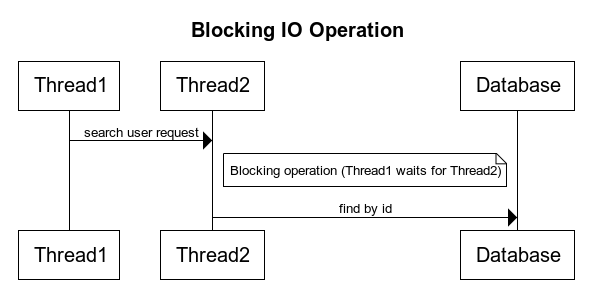
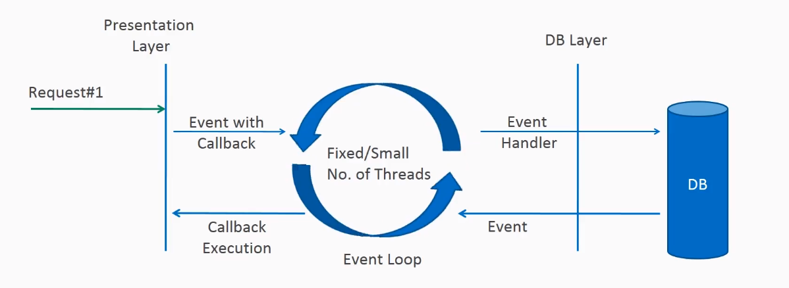
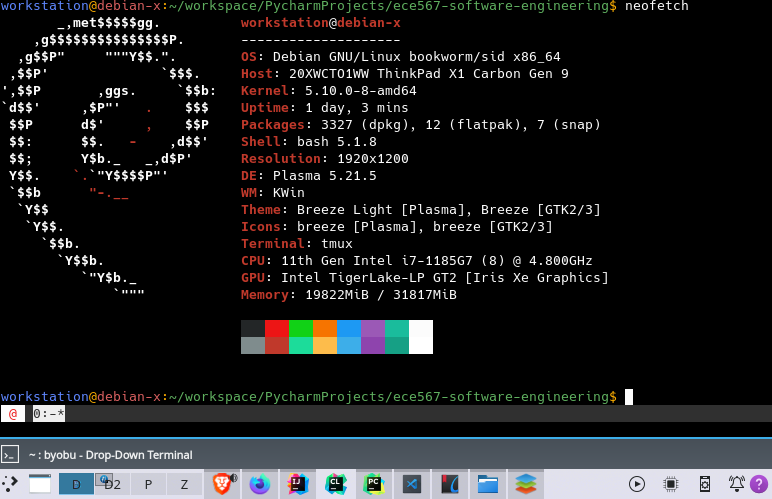

# Topic: A leap from Thread based model to reactive model focusing on non-blocking I/O
  
# Objective
An attempt to compare a evolving, rapidly getting adopting paradigm known as reactive programming.
Intent is to compare it with imperative (traditional) style of programming and analyze the tradeoffs.

# Definitions
##Reactive 
- code that reacts to changes - Observable
- IObservable<T> and IObserver<T>
- Sometime, in the future, someone is going to give me data, how do I reason about it
- Reactive programming means you register a callback and a framework is responsible for calling your callback correctly

## Imperative
* where the code executes linearly - Iterable 
* IEnumerable<T> and IEnumerable<T>
* I want all the data now! or I’ll stand here and wait, no one can do anything until I get my data!
* Imperative programming means you are responsible for pulling an event off of a queue.

### Imperative Example
Assume that we need to retrieve list of records from the database.
As shown below, Thread 1 has to wait until thread 2 completes the database operation and fetch the list of users. 
In a concurrent environment, the web server is limited with maximum no of threads that can handle with the available resources (i.e. By default, Tomcat sets MAX_THREADS to 200). 
We can increase the amount by adding additional physical resources which is not a better solution.

### Reactive Definition
Reactive programming is about non-blocking, event-driven applications that scale with a small number of threads with backpressure as a key ingredient that aims to ensure producers do not overwhelm consumers. 

### Reactive - Non Blocking Request Processing Example
In non-blocking or asynchronous request processing, no thread is in waiting state. 
There is generally only one request thread receiving the request. 
As per below, Request 1 is handed over the presentation layer which uses a single thread to process it (Lets assume Presentation-Layer-Thread-01) . 
Presentation-Layer-Thread-01 hands over the IO High intensive DB Operation to Event Loop ( Let’s assume Thread-Loop-01). 
The importance here is that, a callback is registered for the Thread-Loop-01 (which does the db operation) to trigger the next step of Presentation-Layer-Thread-01. 
In the meantime, Presentation-Layer-Thread-01 is now available for the client (presentation layer) to accept more requests. 
With that approach the server gets to accept more concurrent requests and process with the same limited resources available.

# What use-cases are good for reactive ?
Reactive applications are best suited for the applications which has higher blocking factor.
If there are a lot of network calls like within a typical microservices arch where services communicate over network, it absolutely makes sense to use reactive stack.
Secondly, if the application is using a lot of database calls, since at the time database is processing query the application is doing nothing. 
For database usage, we need to use a database driver which support native non-blocking request.

# Challenges in Reactive Programming
Debugging is a big challenge in reactive apps. There's no debug pointer which can move one step at a time and we our values right in the debugger.
Debugging techniques also change in reactive apps, like the stack trace now looks very very different. 
Several projects have documented alternative techniques to debuggin like here's what I used in my project.
https://projectreactor.io/docs/core/snapshot/reference/#debugging

# Performance Metrics
Machine Specs - 

|Metric Name |Imperative Impl|Reactive Impl| Observation | 
|---|---|---|---|
| Avg. Single hit Response time - Measured via bechmarks.js|503 ms|503ms| The imperative and reactive are almost the same response time when a single API hit is done. CPU usage is negligible.|
| Avg. Bulk hit reponse time - 100 workers for 2000 requests| 11.151306629180908s| 11.104765176773071s| Marginal Difference is response time. 
| Avg. Bulk hit reponse time - 1000 concurrent workers for 2000 requests|5.325268507003784s|4.414325475692749s|**Considerable Difference is observed when number of requets are high, and resources are limited. There also a reason of kernel scheduling as with reactive there are 8 threads vs 200 in imperative. The kernel scheduling  face less context overhead in case of reactive.** | 

# Conclusion
* While handling streaming and data manipulation like count, sum, transformation use functional programming, i.e. instead of iterating every time, call a method (or function) on the collections to do it for you.
* If there is an asynchronous flow or when one or more components have to know about other component changes (create, edit & delete) then use reactive programming (event-based publisher/subscriber model).
* If you have a blocking code in your system like Db calls, network calls reactive stack might perform better specially under high pressure.
* If it is asynchronous processing that needs to go through several transformations and has processing then use functional reactive programming.

# References
https://www.reactivemanifesto.org/

https://www.reactive-streams.org/

